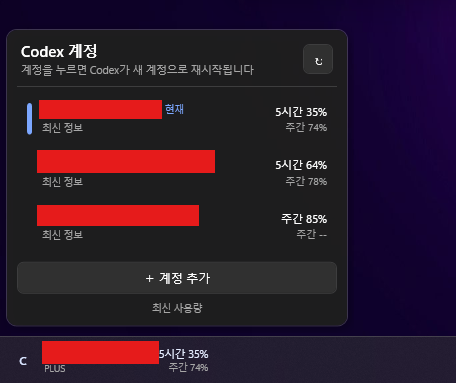

# Codex 계정 작업 표시줄 위젯

Windows 11 작업 표시줄의 왼쪽 영역을 덮어 현재 Codex 계정과 남은 사용량을 표시하는 WPF 위젯입니다. 위젯을 누르면 작업 표시줄 바로 위로 등록된 계정 목록이 열리고, 계정을 한 번 누르면 Codex가 선택한 계정으로 자동 재시작됩니다.

> 이 프로젝트는 비공식 커뮤니티 도구이며 OpenAI의 공식 제품, 제휴 제품 또는 승인 제품이 아닙니다. Codex 데스크톱 앱과 App Server의 동작이 변경되면 일부 기능이 예고 없이 작동하지 않을 수 있습니다.

## 실행 화면



작업 표시줄에는 현재 계정과 단기·주간 잔여량을 간단히 표시합니다. 위젯을 누르면 등록한 계정과 각 계정의 남은 사용량이 위쪽으로 펼쳐지며, 원하는 계정을 선택해 전환할 수 있습니다. 공개 화면에서는 개인정보 보호를 위해 이메일 주소를 가렸습니다.

## 다운로드

- [CodexAccountSwitcher-Setup.exe 최신 설치 파일](https://github.com/qjatlr1111/codex-account-switcher/releases/latest/download/CodexAccountSwitcher-Setup.exe)
- [CodexAccountSwitcher.exe 최신 무설치 파일](https://github.com/qjatlr1111/codex-account-switcher/releases/latest/download/CodexAccountSwitcher.exe)
- [SHA256SUMS.txt 최신 무결성 확인 파일](https://github.com/qjatlr1111/codex-account-switcher/releases/latest/download/SHA256SUMS.txt)
- [모든 GitHub Release 보기](https://github.com/qjatlr1111/codex-account-switcher/releases)

설치형은 Windows 로그인 자동 실행과 시작 메뉴·제거 프로그램 구성이 편리합니다. 무설치형은 파일 하나를 내려받아 바로 실행할 수 있습니다. 두 파일 모두 현재 코드 서명되지 않았기 때문에 처음 실행할 때 Windows SmartScreen 경고가 표시될 수 있습니다.

## 현재 구현된 기능

- Windows 로그인 시 백그라운드 자동 실행
- 2초마다 가볍게 Codex 창을 확인하고, Codex가 실행 중일 때만 작업 표시줄 왼쪽에 오버레이 표시
- Codex를 최소화하면 위젯을 유지하고 완전히 종료하면 자동으로 숨김
- 기본 상태에서는 완전히 투명하고, 마우스를 올렸을 때만 Windows 11 스타일의 둥근 반투명 오버레이 표시
- 현재 계정 이메일과 요금제 표시
- Codex 단기·장기 제한의 남은 비율 표시
- 위젯 클릭 시 위쪽으로 계정 목록 펼치기
- 계정별 이메일, 요금제, 단기·주간 잔여량 표시
- `＋ 계정 추가`를 누르면 공식 Codex 브라우저 로그인 실행
- 계정 항목을 누르면 확인 다이얼로그를 표시하고, 승인한 경우에만 인증 전환 후 Codex 데스크톱 앱 자동 재시작
- `~/.codex/config.toml`의 `[model_providers.<id>]`를 자동 탐지해 회사 게이트웨이 provider 선택
- provider 선택 시 최상위 `model_provider`를 적용하고, ChatGPT 계정 선택 시 해당 줄만 주석 처리해 provider 정의 보존
- 이전 Codex 프로세스가 완전히 정리된 상태를 확인한 뒤 Windows 패키지 앱 활성화를 한 번만 요청
- 새 Codex 프로세스가 아니라 실제 표시 창이 열린 경우에만 재시작 완료로 판정
- 프로세스만 시작되고 창이 열리지 않으면 중복 실행하지 않고 30초 안에 명확한 실패 안내 표시
- 전환 중에는 계정 목록 대신 대상 계정과 현재 처리 단계를 보여주는 진행 화면 표시
- 계정 항목을 우클릭하면 위젯에서 제거
- 위젯을 우클릭하면 계정 목록과 같은 어두운 메뉴가 바로 위에 열리고 `위젯 숨기기` 또는 `프로그램 끝내기` 제공
- 숨긴 위젯은 현재 Codex 실행 세션 동안 다시 나타나지 않으며, 다음 Codex 실행 때 자동 복원
- 시스템 트레이에서 `위젯 표시`, `Codex 실행 중에만 표시`, `Windows 시작 시 자동 실행`, `끝내기` 제공
- Codex가 실행 중일 때만 2분마다 사용량 자동 갱신하고 위젯이 나타날 때 즉시 갱신
- 계정 전환을 위해 Codex가 재시작되는 동안에는 위젯을 유지
- Explorer 재시작이나 작업 표시줄 위치 변경 시 위치 재계산

### 위젯 왼쪽의 `C`

작업 표시줄 위젯 왼쪽의 `C`는 현재 계정 이름의 첫 글자나 요금제 표시가 아닙니다. Codex 계정 위젯임을 구분하기 위해 넣은 고정 문자 아이콘이며, 계정을 바꿔도 그대로 유지됩니다. 실제 계정은 `C` 오른쪽의 이메일과 그 아래 요금제로 확인할 수 있습니다.

## 실행 방법

### 가장 간단한 실행

설치하지 않고 바로 실행하려면 [CodexAccountSwitcher.exe 최신 버전](https://github.com/qjatlr1111/codex-account-switcher/releases/latest/download/CodexAccountSwitcher.exe)을 내려받아 더블 클릭합니다. 이 파일은 .NET 런타임을 포함한 자급형 단일 EXE입니다. 단, 계정 조회 기능을 사용하려면 전역 `codex` 명령이 설치되어 있어야 합니다.

일반 설치를 원하면 [CodexAccountSwitcher-Setup.exe 최신 설치 파일](https://github.com/qjatlr1111/codex-account-switcher/releases/latest/download/CodexAccountSwitcher-Setup.exe)을 내려받아 실행합니다. 설치하면 Windows 로그인 시 위젯이 백그라운드에서 자동 실행되며, 시스템 트레이에서 자동 실행 여부를 언제든 바꿀 수 있습니다. 설치 마법사에서는 다음 항목을 선택할 수 있습니다.

- 바탕 화면 바로 가기
- 설치 완료 후 바로 실행
- 시작 메뉴 바로 가기와 제거 프로그램

### 소스에서 실행

먼저 .NET 8 SDK와 전역 `codex` 명령이 설치되어 있어야 합니다.

```powershell
dotnet build CodexAccountWidget.sln
dotnet run --project CodexAccountWidget
```

이미 한 번 빌드했다면 루트의 `run.cmd`를 실행해도 됩니다. 실행 파일이 없을 때만 자동으로 Debug 빌드를 수행합니다.

## 배포 파일 만들기

Inno Setup 6이 설치된 Windows에서 다음 파일을 더블 클릭합니다.

```text
Build-Installer.cmd
```

또는 PowerShell에서 실행합니다.

```powershell
./scripts/Build-Installer.ps1 -ApplicationVersion 1.1.4
```

출력은 다음과 같습니다.

```text
dist/
├─ CodexAccountSwitcher.exe
├─ CodexAccountSwitcher-Setup.exe
└─ SHA256SUMS.txt
```

`CodexAccountSwitcher.exe`는 무설치 단일 실행 파일이고, `CodexAccountSwitcher-Setup.exe`는 한국어 Inno Setup 설치 파일입니다.

## GitHub 배포

저장소에는 [`.github/workflows/release.yml`](.github/workflows/release.yml)이 포함되어 있습니다. `v1.0.0` 같은 SemVer 태그를 푸시하면 Windows runner에서 단일 EXE와 설치 파일을 다시 만들고 GitHub Release에 다음 세 파일을 첨부합니다.

```text
CodexAccountSwitcher.exe
CodexAccountSwitcher-Setup.exe
SHA256SUMS.txt
```

수동으로 GitHub Actions의 `Windows Release` 워크플로를 실행하면 Release를 생성하지 않고 Actions artifact만 만들 수 있습니다.

## 공개 저장소와 라이선스

이 저장소는 누구나 소스와 Release를 확인할 수 있는 Public 저장소입니다. 다만 현재 별도의 오픈소스 `LICENSE` 파일을 제공하지 않습니다. 저장소가 Public이라는 사실만으로 복제·수정·재배포·상업적 사용 권한이 자동 부여되지는 않으며, 별도 허락이 없는 한 기본 저작권이 적용됩니다.

Public 저장소에는 실제 사용자의 이메일, 액세스 토큰, `auth.json`, `profiles.json`을 올리지 않습니다. 관련 인증파일과 로컬 프로필 폴더는 `.gitignore`로 차단되어 있지만, Issue나 로그를 직접 첨부할 때도 인증정보가 포함되지 않았는지 반드시 확인해야 합니다.

## 계정 추가와 전환

1. 작업 표시줄 왼쪽의 위젯을 누릅니다.
2. `＋ 계정 추가`를 누릅니다.
3. 열린 브라우저에서 추가할 ChatGPT 계정으로 로그인합니다.
4. 로그인이 끝나면 이메일과 사용량이 목록에 추가됩니다.
5. 목록의 계정을 누르면 Codex가 종료되고, 해당 인증 캐시가 기본 Codex 인증 위치에 적용된 뒤 Codex가 자동으로 다시 실행됩니다.

`config.toml`에 custom model provider가 있으면 계정 목록 위에 provider 선택 항목이 표시됩니다. provider를 선택하면 최상위 `model_provider` 값이 해당 id로 설정됩니다. 이후 ChatGPT 계정을 선택하면 위젯이 그 선택 줄을 주석 처리하며, `[model_providers.<id>]` 안의 게이트웨이 주소와 인증 설정은 변경하거나 삭제하지 않습니다.

계정을 등록한 직후에는 자동으로 전환하지 않습니다. 계정 전환은 `Codex 정상 종료 요청 → 최대 5초 대기 → 남아 있는 Codex 패키지 프로세스 종료 → 약 1초 동안 완전 종료 상태 확인 → 인증 캐시 전환 → Windows 패키지 앱 활성화 → 실제 표시 창 확인` 순서로 처리됩니다. 실행 요청 후 표시 창이 열리지 않으면 한 번 더 실행을 시도하고, 두 번 모두 실패하면 직접 실행 안내를 표시합니다. 실행 중인 작업과 작성 중인 입력은 중단될 수 있으므로 계정을 누르기 전에 중요한 작업이 끝났는지 확인해야 합니다. 위젯 프로세스는 종료되지 않습니다.

## 사용량 표기 방식

Codex App Server의 `account/rateLimits/read`가 반환하는 각 제한 구간의 `usedPercent`를 읽어 다음과 같이 표시합니다.

```text
남은 사용량 = 100 - usedPercent
```

제한 구간이 7일 정도이면 `주간`, 정수 시간 단위이면 `5시간`과 같은 형태로 표시합니다. 서버에서 장기 구간을 제공하지 않으면 `--`로 표시합니다.

## 인증 정보 보관과 주의사항

- **중요:** 이 앱은 계정 전환을 위해 Codex의 `auth.json`을 사용합니다. 이 파일에는 액세스 토큰이 포함되며 비밀번호와 동일한 수준으로 취급해야 합니다.
- 계정별 Codex 홈은 `%USERPROFILE%\.codex-account-switcher\profiles\<계정 ID>`에 분리됩니다. `%LOCALAPPDATA%`는 Codex 패키지 실행 컨텍스트에 따라 파일 가상화가 적용될 수 있어 사용하지 않습니다.
- 프로필 저장 폴더는 현재 Windows 사용자, SYSTEM, Administrators만 접근하도록 ACL 상속을 제한합니다. 다만 인증 캐시는 Codex 호환성을 위해 디스크에 평문 파일로 존재하므로, 공유 PC·공용 계정·신뢰할 수 없는 Windows 사용자 환경에서는 사용하지 않는 것을 권장합니다.
- 이전 `%LOCALAPPDATA%\CodexAccountWidget` 및 Codex 패키지 가상화 저장소의 데이터는 첫 실행 때 계정 수가 가장 많은 원본을 선택해 새 저장소로 복사하고, 인증파일 해시 검증 후 목록을 저장합니다. 기존 데이터는 자동 삭제하지 않습니다.
- 위젯 자체의 `profiles.json`에는 이메일, 표시 상태, 프로필 경로만 저장하고 액세스 토큰을 직접 기록하지 않습니다.
- 실제 로그인 캐시는 각 프로필의 Codex App Server가 관리합니다.
- 계정을 전환할 때 기존 `%USERPROFILE%\.codex\auth.json`은 `%USERPROFILE%\.codex\auth.widget-backup.json`으로 한 개만 백업됩니다.
- 공식 Codex 인증은 환경에 따라 `auth.json` 또는 운영체제 자격 증명 저장소를 사용할 수 있습니다. 운영체제 자격 증명 저장소를 강제하는 환경에서는 이 첫 버전의 파일 기반 전환이 데스크톱 앱에 바로 적용되지 않을 수 있습니다.
- 활성 계정은 실수로 인증 캐시를 지우지 않도록 제거할 수 없습니다. 다른 계정으로 먼저 전환한 뒤 제거합니다.
- 우클릭 제거는 해당 위젯 전용 프로필 폴더와 그 안의 로그인 캐시를 삭제합니다. ChatGPT/OpenAI 계정 자체를 삭제하는 기능은 아닙니다.
- 인증파일, 프로필 폴더, 로그를 Git 저장소·이슈·메신저·클라우드 공유 폴더에 업로드하지 마세요. 계정이 노출됐다고 의심되면 Codex에서 로그아웃하고 해당 ChatGPT/OpenAI 세션을 폐기한 뒤 다시 로그인하세요.

## 프로젝트 구성

```text
CodexAccountWidget/
├─ OverlayWindow.xaml              작업 표시줄을 덮는 상시 위젯
├─ AccountPanelWindow.xaml         위쪽으로 펼쳐지는 계정 목록
├─ Services/
│  ├─ CodexAppServerClient.cs      JSONL 기반 Codex App Server 클라이언트
│  ├─ CodexAccountService.cs       로그인, 계정 조회, 사용량, 전환
│  ├─ CodexDesktopRestartService.cs Codex 패키지 탐지, 종료 및 재실행
│  ├─ ProfileStore.cs              계정 프로필 목록 저장
│  ├─ StartupRegistrationService.cs Windows 로그인 자동실행 관리
│  └─ TaskbarLocator.cs            작업 표시줄 위치 확인
└─ ViewModels/MainViewModel.cs     화면 상태 및 명령 처리

CodexAccountWidget.Smoke/
└─ Program.cs                      App Server 초기화·계정 조회 스모크 테스트
```

## 검증 명령

```powershell
dotnet build CodexAccountWidget.sln
dotnet run --project CodexAccountWidget.Smoke --no-build -- .smoke-profile
dotnet run --project CodexAccountWidget.Smoke --no-build -- --detect-codex
```

첫 번째 스모크 테스트는 지정된 임시 `CODEX_HOME`에서 App Server를 실행하고 `initialize`와 `account/read` 응답 형식을 확인합니다. 두 번째 테스트는 실행 중인 `OpenAI.Codex` 패키지 프로세스와 실제 표시 창을 읽기 전용으로 탐지하며 종료하지 않습니다. 실제 계정 토큰이나 이메일은 출력하지 않습니다.

## 현재 범위

현재 설치 파일은 코드 서명 인증서로 서명되지 않았습니다. 따라서 다른 PC에서 처음 실행할 때 Windows SmartScreen 경고가 나타날 수 있습니다. 작업 표시줄 왼쪽을 실제로 덮기 때문에 Windows 시작 버튼 또는 검색 영역 일부가 가려질 수 있습니다.
